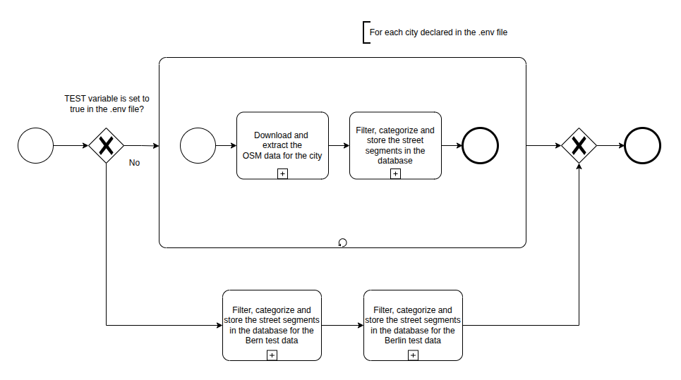
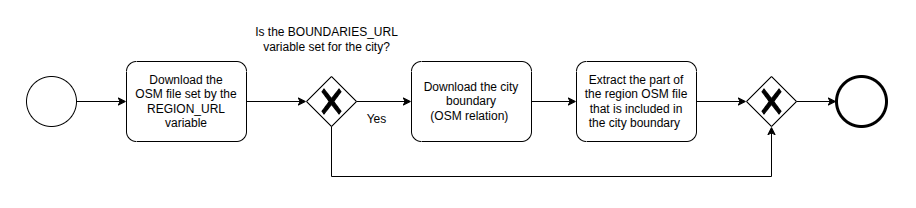
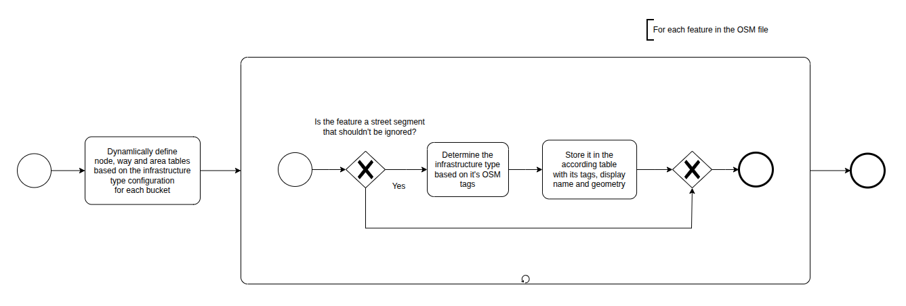
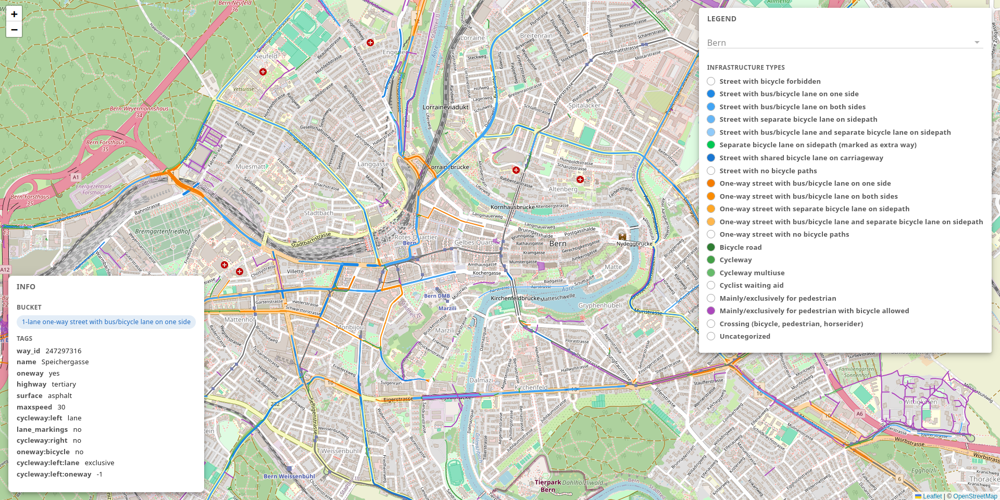
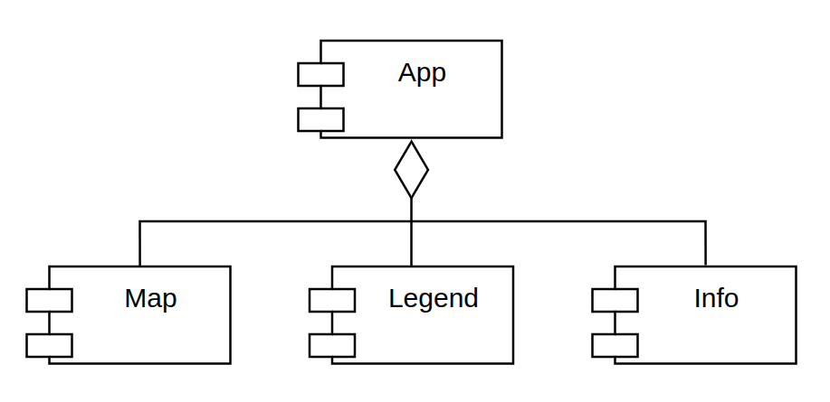
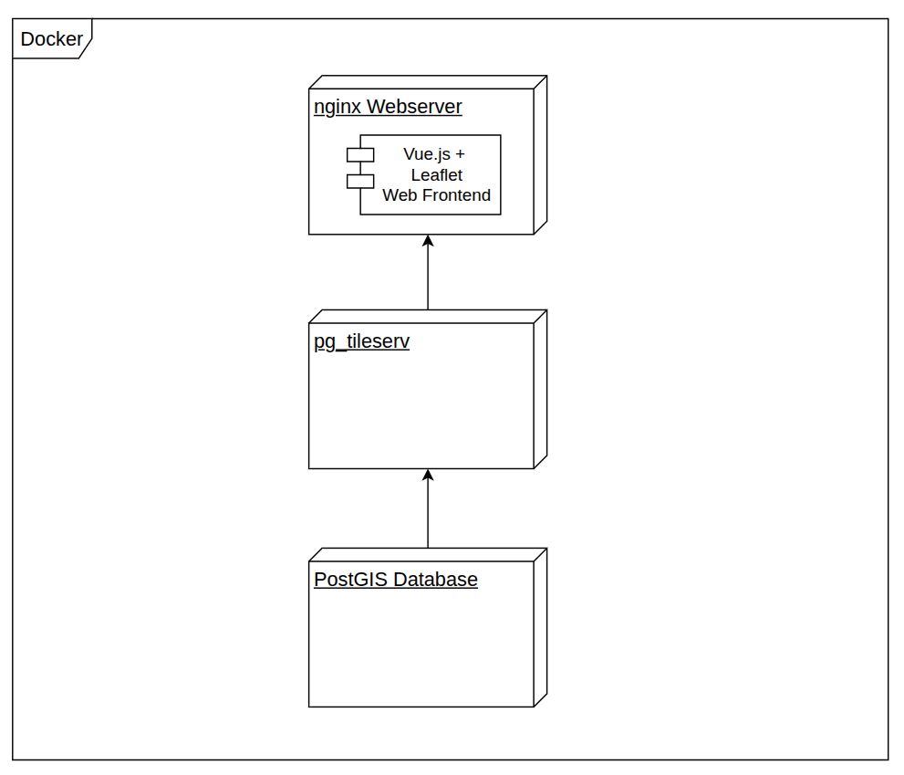

# Identifying Street Infrastructure Types from OpenStreetMap Data

## Description

The goal of this tool is to automatically categorize OpenStreetMap (OSM) street segments into predefined infrastructure buckets and visualize them in a web application. It is part of a bachelor thesis and can process the cities Bern, Berlin, Weimar and Wichita Falls.

The processing part of the tool mainly consists of two steps. The downloading of the required OSM data and the filtering, categorization and storing of the street segments inside a database. These steps are performed for each city that is declared \
in the _.env_ file. \
If the E2E test should be executed the download steps gets skipped and the test data for Bern and Berlin gets processed. For more information check the [test documentation.](import/flex/test/README.md)

<div align="center">
  
</div>

First the latest OSM data gets downloaded from [Geofabrik](https://www.geofabrik.de/) for the current city. If the city has no dedicated download endpoint, the next bigger area is downloaded and the city data is extracted using the [Osmium Tool](https://osmcode.org/osmium-tool/) and the cities boundary (OSM relation). You can set that by either setting the Geofabrik city download URL in the `REGION_URL` parameter of the _.env_ file, or the next bigger area as the `REGION_URL` and the boundary as the `BOUNDARIES_URL` parameter.

<div align="center">
  
</div>

Afterwards the needed node, way and area tables get dynamically defined based on a [configuration file](import/flex/infrastructure_types.lua) for each infrastructure bucket. Each feature of the OSM dataset from the previous step will be processed, but only non-ignorable features will be stored. These include the street segments and additionally crossings and cyclist waiting aids marked as nodes and pedestrian areas. Ignored features are for example traffic signs, elevators or corridors inside buildings. After a feature is evaluated as non-ignorable, it's infrastructure type gets determined based on it's OSM tags. Then it gets stored in the according database table including the OSM tags, the display name of the bucket and the geometry information. Used technologies in this step are the [PostgreSQL](https://www.postgresql.org/) database with the [PostGIS](https://postgis.net/) extension and the [OSM2PGSQL](https://osm2pgsql.org/) tool. The result of this step are populated database tables e.g. _bern_2_l_s_with_bus_bic_lane_on_one_side_ representing 2-lane two-way streets with a bus or bicycle lane on one side in Bern.

<div align="center">
  
</div>

The frontend was developed with [Vue.js](https://vuejs.org/) and [leaflet](https://leafletjs.com/) with [Leaflet.Vectorgrid](https://github.com/Leaflet/Leaflet.VectorGrid). The street segments are visualized in different colors and can be (de-)selected in the map by clicking the bullet point in the legend. To improve readability the lane information is abstracted in the legend, but visible when hovering the street segment. Also, an example street and a description are shown when hovering the infrastructure type in the legend. The centered city can be changed using the select component in the legend.

<div align="center">
  
</div>

The root component that handles the visibility of the infrastructure types, the additional
info and the centered city is App.vue. It gathers the information from a configuration file
and renders the child components. Map.vue is responsible for displaying the geographic
elements. The base map is fetched as raster tiles from OSM. The street infrastructure
is fetched as vector tiles and each infrastructure category is added as a layer to provide
the functionality of toggling its visibility. The legend and info functionality is handled in
there respective Legend.vue and Info.vue components, before manipulating the state in
the App.vue component.

<div align="center">
  
</div>

[Docker](https://www.docker.com/) and [Docker Compose](https://docs.docker.com/compose/) is used to manage the application stack. The web frontend is built
when starting the stack and is encapsulated in a [nginx](https://nginx.org) web server. The vector tiles,
including the processed street infrastructure, get provided by [pg_tileserv](https://access.crunchydata.com/documentation/pg_tileserv/latest/). For the spatial database, a [PostGIS](https://postgis.net/) database container is used.

<div align="center">
  
</div>

## Repository Structure

This monorepo consists of multiple projects and directories:

- **docker**: Configuration and initialization files that are mounted to the Docker containers
- **download**: Script to download and extract the OSM street segments
- **frontend**: Code for the street segment visualization
- **import**: Scripts for filtering, categorizing and storing the street segments inside the database
- **jupyter_notebook**: Python Jupyter Notebook to analyze the processed street segments
- **utils**: Helper scripts to prepare the E2E test data, generate the database startup script and images

## Usage

### Prerequisites

- Ubuntu 24.04.04 LTS with the latest updates
- curl 8.5.0
- Docker 29.3.1 with Docker Compose and possibility to execute docker as a non-root user ([Installation guide](https://docs.docker.com/engine/install/ubuntu/#install-using-the-repository))

### Installing the Dependencies

1. Install [Osmium Tool](https://osmcode.org/osmium-tool/):

```sh
sudo apt install osmium-tool
```

2. Install [OSM2PGSQL](https://osm2pgsql.org/):

```sh
sudo apt install osm2pgsql
```

### Env File Configuration

1. Create a `.env` file based on the `.env.example` in the root project directory

```sh
cp .env.example .env
```

### Services Startup

1. Start the Docker services:

```sh
docker compose up -d
```

### Street Processing

1. Execute the street segment processing with the values according to the .env file:

```sh
./process.sh
```

### Open the Frontend

1. Open the frontend in the browser e.g.: _http://localhost:8080/_

### Test Setup

[Follow the test setup instructions.](import/flex/test/README.md)

### Python Jupyter Notebook Setup

[Follow the Jupyter Notebook Setup Instructions.](jupyter_notebook/README.md)

### Additional Setup

- If you want to rerun the processing, execute the following script: `./rerun.sh`
- If you want to add a new city follow [these instructions](import/README.md)
- If you want to add a new infrastructure category follow [these instructions](utils/README.md)

## Frontend Development Setup

### Prerequisites

- Node.js 25.8.0 ([Installation through Node Version Manager is recommended](https://github.com/nvm-sh/nvm))
- npm 11.11.0

1. Navigate to the frontend directory:

```sh
cd frontend
```

2. Install the dependencies:

```sh
npm install
```

3. Start the development server:

```sh
npm run dev
```

4. Open the frontend in the browser e.g.: _http://localhost:5173/_

## Acknowledgements

The [OpenStreetMap](https://www.openstreetmap.org) data used in this project is provided by [OpenStreetMap Foundation](https://osmfoundation.org/) available under the Open Data Commons Open Database License.

The following example images for the infratructure category are provided by the OpenStreetMap Wiki under the Creative Commons License. The following images are used:

- https://wiki.openstreetmap.org/wiki/File:456Humboldtstr.jpg
- https://wiki.openstreetmap.org/wiki/File:Morgendlicher_Berufsverkehr_auf_der_BAB_A8_beim_Kreuz_Stuttgart_-_panoramio.jpg
- https://wiki.openstreetmap.org/wiki/File:Primary-photo.jpg
- https://wiki.openstreetmap.org/wiki/File:Fietsstrook_Herenweg_Oudorp.jpg
- https://wiki.openstreetmap.org/wiki/File:Cambridge_Rd_-_geograph.org.uk_-_1189572.jpg
- https://wiki.openstreetmap.org/wiki/File:Footway_in_Stowupland_-_geograph.org.uk_-_1044849.jpg
- https://wiki.openstreetmap.org/wiki/File:Cyclist_footrest_01_Flickr_SDOT_Photos.jpg
- https://wiki.openstreetmap.org/wiki/File:Busspur_und_Haltestelle_in_Mannheim_100_9128.jpg
- https://wiki.openstreetmap.org/wiki/File:Sharrows_Toronto_2011.jpg
- https://wiki.openstreetmap.org/wiki/File:Bikeway,_Bicycle_path_-_sign_C13_marked_beginning_of_bikeway,_Poland,_Sosnowiec.jpg
- https://wiki.openstreetmap.org/wiki/File:Radweg_Schee_Silschede_cut.jpg
- https://wiki.openstreetmap.org/wiki/File:Z241GetrennterRadUndGehweg.png
- https://wiki.openstreetmap.org/wiki/File:549c_Spitzenkiel140923.jpg
- https://wiki.openstreetmap.org/wiki/File:Buffered_bicycle_lane_in_Burlington_VT.jpg
- https://wiki.openstreetmap.org/wiki/File:Zebra-crossing_sm.jpg
- https://wiki.openstreetmap.org/wiki/File:Forest_path_and_trees.jpg

The following example images for the infratructure category is provided by Wikimedia Commons under the Creative Commons Attribution-Share Alike 4.0 International License:

- https://commons.wikimedia.org/wiki/File:Mitte_Am_Zirkus_yoo_Berlin.JPG
- https://commons.wikimedia.org/wiki/File:No_Image_(2879926)_-_The_Noun_Project.svg (this is licensed under the Creative Commons Attribution 4.0 International License)

## Usage of AI Tools
[ChatGPT](https://chatgpt.com/) by [OpenAI](https://openai.com/) in the versions GPT-5.2, GPT-5.3 Instant, GPT-5.4 and GPT-5.5 was used inside the web browser to assist the technical implementation of the system. This includes the code for the unit tests and the Jupyter Notebook.
It was used to generate boilerplate code, analyze error messages during development or to improve the styling in the CSS code. The generated code was manually inspected and adapted to the system by the author (Christian Szramek) before using it.
The system architecture decisions, including the repository and component structure, used services, data flow decisions, function to derive the infrastructure category, the test strategy and the selection of test elements in the unit and E2E tests was manually done by the author. 
